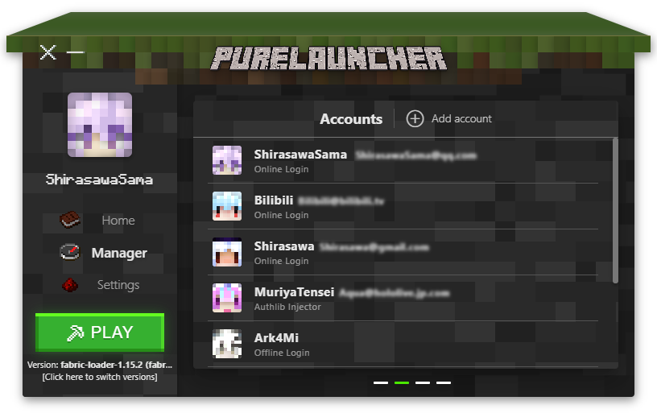
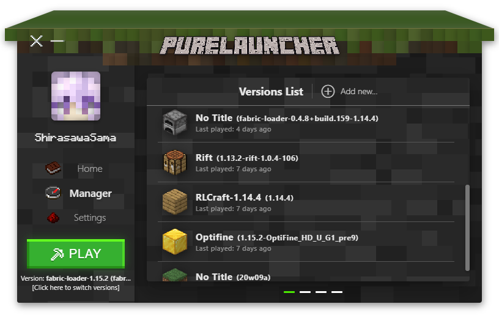

# PureLauncher   [](https://codebeat.co/projects/github-com-apisium-purelauncher-master)   [](https://standardjs.com)

An awesome Minecraft Launcher.

[Official Website](https://pl.apisium.cn)

## Features

- 🚀 Fast launching.
- 💘 Beautiful GUI.
- 🎉 Custom protocol.
- 🤔 Powerful extension and rich API.
- 🎁 One-click download and install resources.
- ✨ And more...

## Snapshots






## Documentation

For plugins developers, resource creators, testers and advanced users:

[https://github.com/Apisium/PureLauncher/wiki](https://github.com/Apisium/PureLauncher/wiki)

## Build

**Please do not use [Yarn](https://yarnpkg.com) !**

### Requirements

- Nodejs v12.0.0+

### Commands

```bash
npm i

npm run build

npm run pack
```

Use taobao registry:

```bash
set REGISTRY=https://registry.npm.taobao.org/
set dist-url=http://npm.taobao.org/mirrors/atom-shell
set ELECTRON_MIRROR=http://npm.taobao.org/mirrors/electron/
set ELECTRON_CUSTOM_DIR=8.2.2
```

### Development

```bash
# Run debugging server:
npm start

# Run Electron:
npm run run
```

## Authors

- Shirasawa
- CI010

## Thanks

- Baleine2000
- Fleey

## License

[MIT](./LICENSE)
